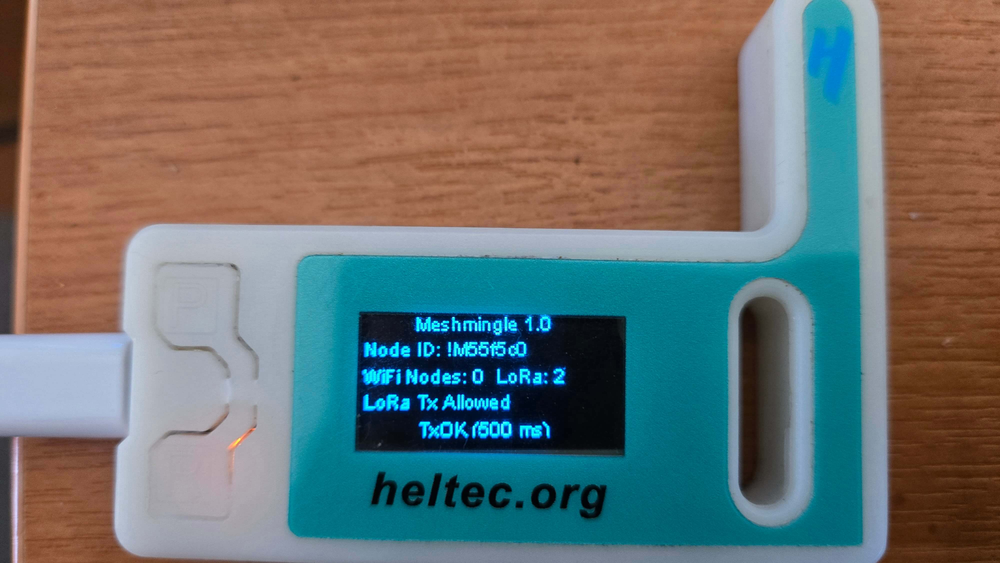
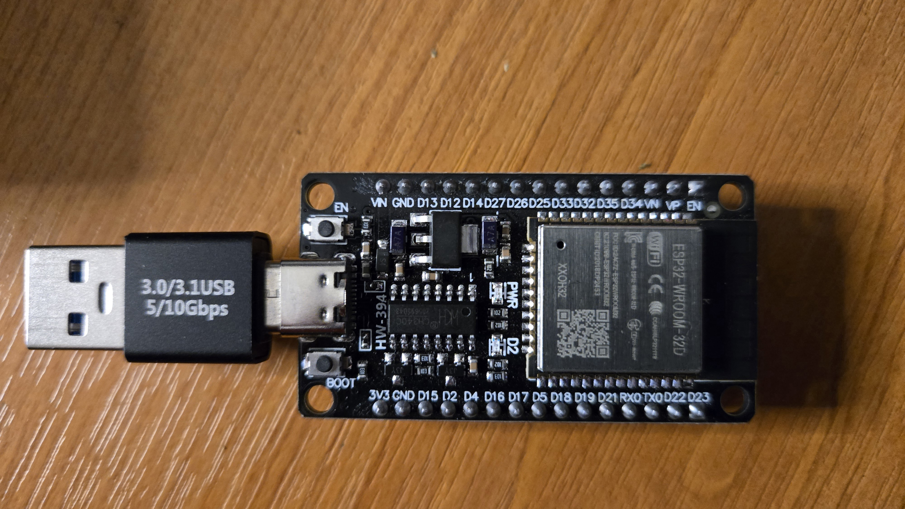
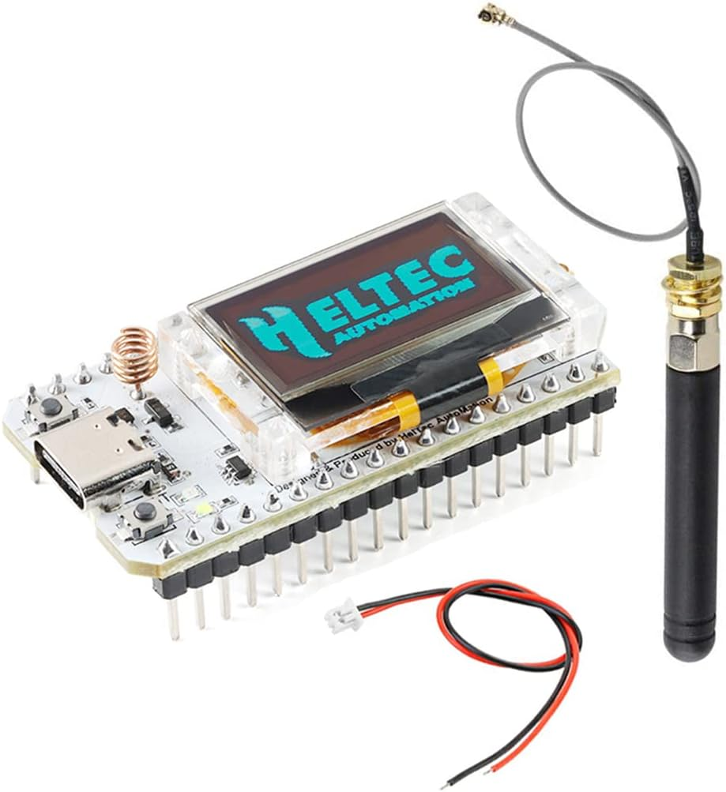

<head>
    <meta charset="UTF-8">
    <meta name="viewport" content="width=device-width, initial-scale=1.0">
</head>
<body>
    

        <h1>Welcome to Meshmingle</h1>
        
Meshmingle is a free homebrew mesh chat network that works through WiFi and LoRa to extend range beyond your home.

        
When connected to WiFi via a mobile device, open your browser and go to <a href="http://mesh.local">http://mesh.local</a> to start chatting.

        
Setup is easy! Just power up your device after flashing, and you're good to go.

        
It is recommended to use a Heltec V3 LoRa device and connect it to an external antenna for longer range, although an external antenna is not required if many users are nearby on the same network.

        
Each device on the mesh acts as a relay, so any messages sent will relay through all connected devices.

        
You can purchase a Heltec V3 LoRa (868) device from the link below:

        <a href="https://www.aliexpress.com/item/1005008177147021.html" class="button" target="_blank">Buy Heltec V3 LoRa</a>
        <h2>Flash Your Device</h2>
        
        
         
        
        
You can install/flash directly to your device from the links below using your PC. No additional software required (some browsers may not work; Chrome is recommended). Ensure you have the necessary drivers installed.

        <a href="/HeltecV3flash.html" class="button">Flash Heltec V3</a>
         
        <a href="/ESP32VroomFlash.html" class="button">Flash ESP32 Vroom</a>
    

</body>
</html>
